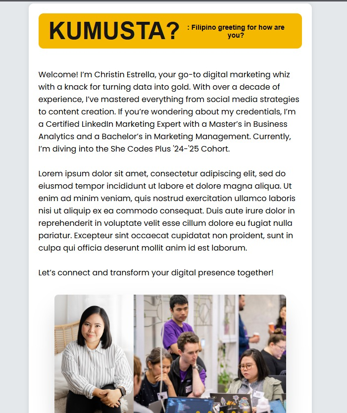
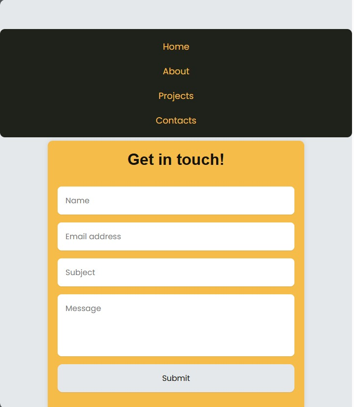
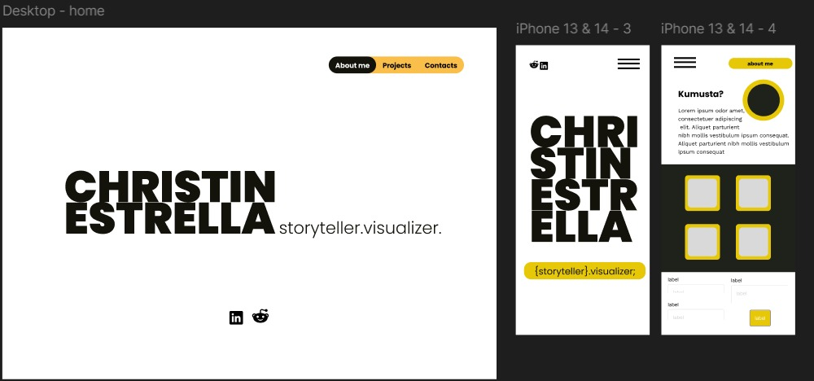
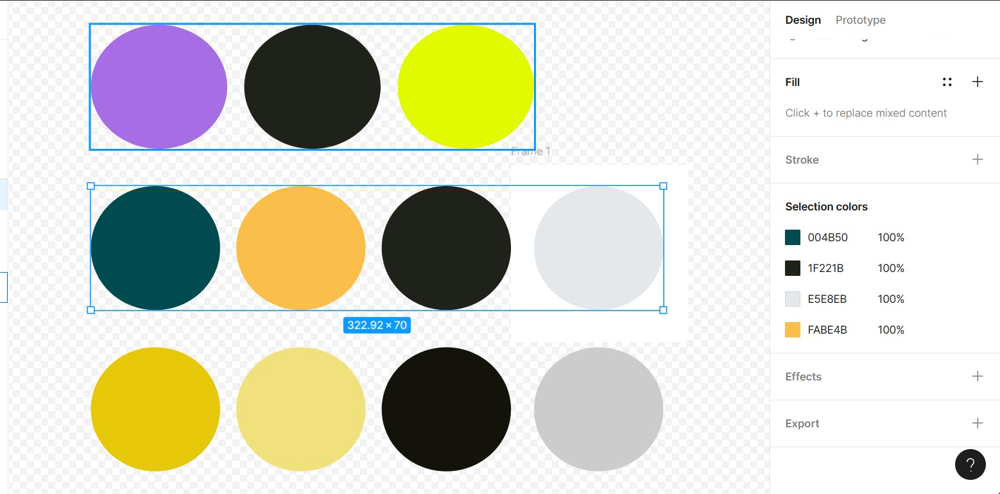
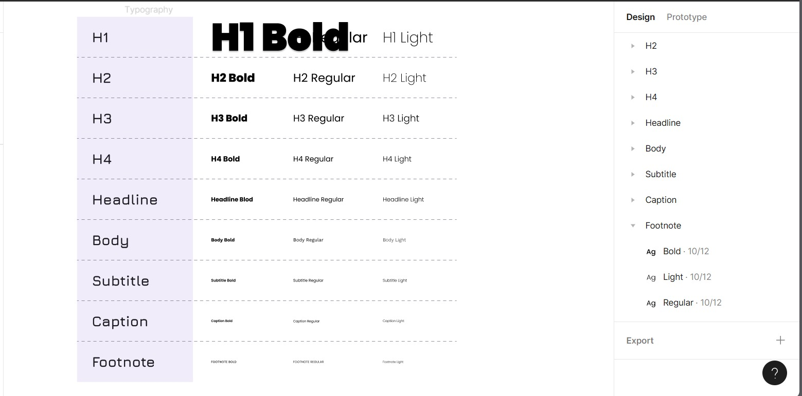

Christin Estrella - Portfolio 
​
https://ccestrella.github.io/
​
## Project Requirements

### Content
- [ ] Biography (at least 100 words): For the biography section, I included a brief background about myself along with photos in a carousel format. This choice was made to highlight my experience with the She Codes 1-Day Workshop event, complemented by a formal portrait.
 #### About Me Page - Desktop View

 #### About Me Page - Mobile View

- [ ] Functional Contact Form: I added required fields to the contact form, ensuring that users must provide their name and email before submitting. This is important because it helps me ensure that I can follow up with users effectively and reduces the likelihood of receiving incomplete or anonymous inquiries. I also fixed my hamburger on  the top for both dekstop and mobile view for easy access.
 #### Contact Page

       #### Contact Page

- [ ] "Projects" section:  I organized my projects into three categories to better showcase my transferable skills across different areas. This approach was inspired by pricing tables used by SaaS companies, which effectively categorize and present information. Hover effect is also applied.
#### Projects Page

- [ ] Links to external sites, e.g. GitHub and LinkedIn: I included links to my GitHub and LinkedIn profiles at the bottom of the home page for desktop view. On mobile devices, these links move to the upper right of the screen. This layout makes it convenient for users to access my social profiles regardless of the device they are using.
#### My Socials

​
#### My Socials

### Technical
 Add a short paragraph describing the features below. What strategies or design decisions did you work from? 
- [ ] At least 2 web pages: I opted to include four pages—Home, About, Projects, and Contact—rather than consolidating everything into a single long scroll. This decision was made to enhance user experience by allowing each section to be accessed independently, providing a more organized and focused navigation.
      
- [ ] Version controlled with Git: The project is now live on GitHub. This version control system ensures that changes are tracked and managed efficiently, allowing collaborators and users to view the project's development history and contribute if needed. It also provides a backup and a version history, which is crucial for maintaining and updating the website.
      
- [ ] Deployed on GitHub pages:  The website is publicly accessible through GitHub Pages. This deployment method allows users to view the website live, making it easy for potential employers, clients, or visitors to access and review the site directly from the web.
      
- [ ] Implements responsive design principles:I used Flexbox across all pages to ensure the website is fully responsive. This approach helps maintain a clean and adaptive layout on various screen sizes and devices, enhancing user experience and accessibility. I used Figma to create my wireframe to see a better picture of what I want to achieve.

#### Wireframe

#### Color Scheme

#### Font

      
- [ ] Uses semantic HTML:  I utilized semantic HTML tags such as <header>, <section>, <article>, and <footer>. This practice improves the website’s accessibility and SEO, as it provides meaningful structure and context to the content, making it easier for search engines and assistive technologies to interpret and navigate.

### Bonus (optional)
 Add a short paragraph describing the features below, if you included any. 
- [ ] Different styles for active, hover and focus states.
- [ ] Include JavaScript to add some dynamic elements to your site. (Extra tricky!)
​
### Screenshots
> Please include the following:
> - The different pages and features of your website on mobile, tablet and desktop screen sizes (multiple screenshots per page and screen size).
> - The different features of your site, e.g. if you have hover states, take a screenshot that shows that.  
> 
> You can do this by saving the images in a folder in your repo, and including them in your readme document with the following Markdown code: 

####  image_title_goes_here 

